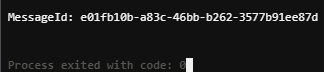

# AWS Messaging Backend

## Overview

This project demonstrates the implementation of a scalable messaging backend using Amazon Web Services (AWS). It leverages AWS SQS (Simple Queue Service) for message queuing and AWS Lambda for serverless message processing. The backend is designed to handle message sending, receiving, and processing efficiently and securely, all managed through the AWS Management Console.

## Key Components and Features

- **AWS SQS**: Ensures reliable and scalable message queuing, supporting high-throughput communication between system components.
- **AWS Lambda**: Implements serverless functions for asynchronous message processing, ensuring quick delivery and efficient resource utilization.
- **Integration**: Utilizes AWS Management Console for setup, configuration, and monitoring of AWS resources.

## Setup Instructions

### 1. AWS Account Setup

- Sign in to the [AWS Management Console](https://aws.amazon.com/console/).
- Ensure IAM roles and policies are configured to allow access to SQS and Lambda services.

### 2. Create SQS Queue

- Navigate to the [SQS service](https://console.aws.amazon.com/sqs/) in the AWS Management Console.
- Create a new SQS queue named `ChatAPP` (or your preferred name) with desired settings.
- Note down the SQS queue URL for later use.

### 3. Create Lambda Function

- Navigate to the [Lambda service](https://console.aws.amazon.com/lambda/) in the AWS Management Console.
- Create a new Lambda function named `MessageProcessor` (or your preferred name).
- Configure the function to trigger from SQS events for automatic message processing.
- Implement your message processing logic in the Lambda function code.

### 4. Configuration

- Replace placeholders in the sender and receiver components with the actual SQS queue URL and Lambda function details.
- Ensure appropriate IAM roles and permissions are set for both sender (for sending messages to SQS) and receiver (for processing messages from SQS).

## Sending and Receiving Messages

### Sending Messages

- Use the AWS SDKs or AWS Management Console to send messages to the SQS queue.

### Receiving Messages

- AWS Lambda automatically triggers and processes messages from the SQS queue, demonstrating serverless message handling.

## Additional Notes

- Monitor and manage your AWS resources through the AWS Management Console for scalability and performance optimization.
- Consider implementing CloudWatch Logs and Metrics for monitoring and troubleshooting message processing.

---
